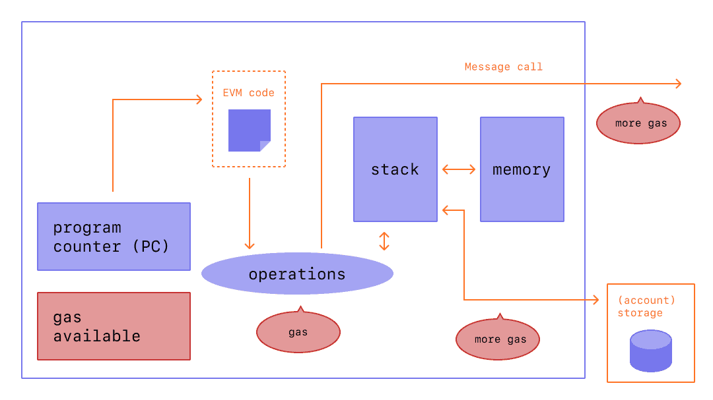

# SEMANA 1 - Etherum maquina virtual-variáveis e operações em solidity

O Solidity tem tipo estático, o que significa que a verificação de tipo ocorre em tempo de compilação, não em tempo de execução, como em linguagens com tipo dinâmico. Com uma linguagem de tipo estático, você precisa especificar o tipo de cada variável. Por exemplo, Python e JavaScript são linguagens de tipo dinâmico, enquanto C++ tem tipo estático.

O Solidity dá suporte à herança, o que significa que as funções, variáveis e outras propriedades presentes em um contrato podem ser usadas em outra. A linguagem também dá suporte a tipos complexos definidos pelo usuário, como structs e enums, que permitem agrupar tipos de dados relacionados.

# 1) Maquina virtual do Ethereum

A Máquina Virtual Ethereum ou EVM é o ambiente de tempo de execução para contratos inteligentes no Ethereum. EVM completamente isolada, o que significa que o código executado dentro do EVM não tem acesso à rede, sistema de arquivos ou outros processos. Os contratos inteligentes têm acesso limitado a outros contratos inteligentes.

## **Contas**

Existem dois tipos de contas no Ethereum que compartilham o mesmo espaço de endereço: 

 * contas externas que são controladas por pares de chaves público-privadas (ou seja, humanos) 
 
 * contas de contrato que são controladas pelo código armazenado junto com a conta.

O endereço de uma conta externa é determinado a partir da chave pública enquanto o endereço de um contrato é determinado no momento da criação do contrato.

 

## **Transações** 

Uma transação é uma mensagem que é enviada de uma conta para outra.Pode incluir dados binários  e Ether.
Se a conta de destino contiver código, esse código será executado e a carga útil será fornecida como dados de entrada.

***criando contrato***

Se a conta de destino não estiver definida, a transação criará um novo contrato.
 Os dados binários enviados refere-se ao bytecode EVM que e executado. Os dados de saída desta execução são armazenados permanentemente como o código do contrato. Isso significa que para criar um contrato, você não envia o código real do contrato, mas sim o código que retorna esse código quando executado.

 

## **Gás**

Após a criação, cada transação é cobrada com uma certa quantidade de gás que deve ser paga pelo originador da transação ( tx.origin). Enquanto o EVM executa a transação, o gás é gradualmente esgotado de acordo com regras específicas. Se o gás for usado em qualquer ponto (ou seja, seria negativo), uma exceção de falta de gás é acionada, que encerra a execução e reverte todas as modificações feitas no estado no frame de chamada atual.

O preço do gás é um valor definido pelo originador da transação, que deve pagar antecipadamente ao executor do EVM. Se sobrar algum gás após a execução, ele é devolvido ao originador da transação. No caso de uma exceção que reverta as alterações, o gás já utilizado não é reembolsado.

 

## **Armazenamento, Memória e Pilha**

A Máquina Virtual Ethereum possui três áreas onde pode armazenar dados: armazenamento(storage), memória(memory) e pilha(stack).

Cada conta tem uma área de dados chamada ***storage***, que é persistente entre chamadas de função e transações. O armazenamento é um armazenamento de valor-chave que mapeia palavras de 256 bits para palavras de 256 bits. Não é possível enumerar o armazenamento de dentro de um contrato, é comparativamente caro para ler e ainda mais para inicializar e modificar o armazenamento.

***Um contrato não pode ler nem gravar em nenhum armazenamento além do seu.***

A segunda área de dados é chamada de ***memória***, da qual um contrato obtém uma instância recém-limpa para cada chamada de mensagem. A memória é linear e pode ser endereçada em nível de byte, mas as leituras são limitadas a uma largura de 256 bits, enquanto as gravações podem ter 8 bits ou 256 bits de largura. A memória é expandida por uma palavra (256 bits), ao acessar uma palavra de memória não tocada anteriormente. No momento da expansão, o custo em gás deve ser pago.

O EVM  é uma máquina de pilha, portanto, todos os cálculos são realizados em uma área de dados chamada pilha. Tem um tamanho máximo de 1024 elementos e contém palavras de 256 bits. O acesso à pilha é limitado ao topo da seguinte forma: É possível copiar um dos 16 elementos mais altos para o topo da pilha ou trocar o elemento mais alto por um dos 16 elementos abaixo dele . Não é possível apenas acessar elementos arbitrários mais profundos na pilha sem primeiro remover o topo da pilha.

**Conjunto de instruções** 

O conjunto de instruções do EVM é mínimo para evitar implementações incorretas ou inconsistentes que podem causar problemas de consenso. Todas as instruções operam no tipo de dados básico, palavras de 256 bits ou em fatias de memória (ou outras matrizes de bytes). As habituais operações aritméticas, de bits, lógicas e de comparação estão presentes. Saltos condicionais e incondicionais são possíveis. Além disso, os contratos podem acessar propriedades relevantes do bloco atual, como seu número e carimbo de data/hora.

Os contratos do Solidity são executados na EVM, a máquina virtual do Ethereum. É um ambiente de área restrita completamente isolado.
Ele não acessa nada mais na rede além dos contratos que executa.

 
 

 
 [Comparativo de transações com BTC](https://txstreet.com/v/eth-btc)- https://txstreet.com/v/eth-btc
    

# 2) Primeiro contrato

Todos os contratos do Solidity normalmente incluem:

* Diretivas pragma   - palavra-chave que você usa para solicitar que o compilador verifique se sua versão do Solidity corresponde à necessária. 
     
      pragma solidity ^0.8.10;

* Os arquivos de origem do contrato sempre começam com a definição ***contract ContractName***.
      
         contract MarketToken { uint price_token; // State variable

* Variáveis de estado - As variáveis de estado são fundamentais para qualquer arquivo de origem do Solidity. Os valores da variável de estado são armazenados permanentemente no armazenamento de contratos.
  
       contract Counter {
         uint256 public count;

  ***public:*** parte da interface do contrato e pode ser acessada de outros contratos.

  ***internal:***  acessada somente dentro do contrato atual.

  ***private:*** visível apenas para o contrato em que está definida.
      
    

* Funções - Em um contrato, as unidades de código executáveis são conhecidas como funções. As funções descrevem uma única ação para obter uma tarefa. Elas são reutilizáveis e também podem ser chamadas de outros arquivos de origem, como bibliotecas.
          
               // O corpo de uma função.
          function funcao( param1 tipo, param2 tipo ) return (uint) {
       ​                           return param1 + param2;
          }

* Eventos  - Eventos descrevem as ações que são executadas no contrato. Semelhante às funções, os eventos têm parâmetros que precisam ser especificados quando o evento é chamado.
  

   [counter.sol](counter.sol)

# 3) Variáveis

   Existem 3 tipos de variáveis no Solidity

   **LOCAL** - declarado dentro de uma função, não armazenado no blockchain
   
   **ESTADO** - declarado fora de uma função, armazenado na blockchain
   
   **GLOBAL** - fornece informações sobre o blockchain
    
   [variables.sol](variables.sol)

# 4) Tipos de dados   primitivos
    
  ## Inteiros (int)
   Os inteiros são usados em cada arquivo de origem do Solidity. Eles representam números inteiros e podem ser com ou sem sinal. Intervalo de inteiros no tamanho do armazenamento de 8 bits a 256 bits.

   - Assinado: inclui números negativos e positivos. Pode ser representado como **int**.
   - Sem sinal: incluem apenas números positivos. Pode ser representado como **uint**.

   Operações podem ser aplicadas a inteiros:

   - Comparações: <=, <, ==, !=, >=, >
   - Operadores de bits: & (and), | (or), ^ (bitwise exclusive), ~ (bitwise negation)
   - Operadores aritméticos: + (addition),- (subtraction), * (multiplication), / (division), % (modulo), ** (exponential)

         int32 price = 25; // signed 32 bit integer
         uint256 balance = 1000; // unsigned 256 bit integer
         balance - price; // 975
         2 * price; // 50
         price % 2; // 1

 ## Booleano (bool) 

Os booleanos são definidos usando a palavra-chave bool. Eles sempre têm um valor de true ou false.

     bool forSale; //true if an item is for sale
     bool purchased; //true if an item has been purchased

     //Os booleanos são comumente usados em instruções de comparação.
     if(balance > 0 & balance > price) {
         return true;
     }
## String (string)
 Cadeia de caracteres, são usados na maioria dos arquivos de contrato. Eles são caracteres ou palavras entre aspas duplas ou simples.
     
      string shipped = "shipped"; // shipped
      string delivered = 'delivered'; // delivered

--------------

## Endereço (address)
Um endereço é um tipo com um valor de 20 bytes que representa uma conta de usuário do Ethereum. Esse tipo pode ser um **address** regular ou um **address payable**.

A diferença entre os dois é que um tipo **address payable** é um endereço para o qual você pode enviar Ether e que contém os membros adicionais e send.

        address payable public buyer; // account for the buyer
        
        function transfer(address buyer, uint price) {
            buyer.transfer(price); //transfers the price of the item
         }

   

   É possível consultar o saldo de um endereço usando a propriedade balance e enviar Ether (em unidades de wei) para um endereço a pagar usando a função transfer:

       address payable x = payable(0x123);
       address myAddress = address(this);
       if (x.balance < 10 && myAddress.balance >= 10) x.transfer(10);

A função transfer falha se o saldo do contrato atual não for grande o suficiente ou se a transferência de Ether for rejeitada pela conta receptora. A transfer reverte em caso de falha.

**Send** é a contrapartida de baixo nível do transfer. Se a execução falhar, o contrato atual não será interrompido com exceção, mas send retornará false.

   **Operadores:**

     <=, <, ==, e !=_>=>

##  Byte

### **bytes de tamanho fixo**

Os tipos de valor bytes1, bytes2, bytes3, …, bytes32 mantêm uma sequência de bytes de um a até 32.

**Operadores:** 

 - Comparações: <=, <, ==, !=, >=, >(avaliar para bool)

 - Operadores de bit: &, |, ^(exclusivo bit a bit ou), ~(negação bit a bit)

 - Operadores de deslocamento: <<(deslocamento à esquerda), >>(deslocamento à direita)

 - Acesso ao índice: Se xfor do tipo bytesI, então x[k]for retorna o º byte (somente leitura).0 <= k < Ik

O operador de deslocamento funciona com o tipo inteiro sem sinal como operando direito (mas retorna o tipo do operando esquerdo), o que denota o número de bits para deslocamento. Deslocar por um tipo assinado produzirá um erro de compilação.

Membros:
- .length retorna  o comprimento fixo da matriz de bytes (somente leitura).

### **bytes de tamanho dinâmico**

bytes: Matriz de bytes de tamanho dinâmico, consulte arrays . Não é um tipo de valor!

string - String codificada em UTF-8 de tamanho dinâmico, consulte arrays . Não é um tipo de valor!

[Solidity Tutorial : all about Bytes](https://jeancvllr.medium.com/solidity-tutorial-all-about-bytes-9d88fdb22676)

[primitives.sol](primitives.sol)

# 5) Constantes:

Constantes são variáveis que não podem ser modificadas.
O uso constante pode economizar custos de gás.

   [constants.sol](constants.sol)

# 6) Variável  Imutável:

Variáveis imutáveis são como constantes. Valores de variáveis imutáveis podem ser definidos dentro do construtor, mas não podem ser modificados posteriormente.

[immutable.sol](immutable.sol)

# 7) Enumerações:

Você pode usar enumerações para criar um tipo definido pelo usuário. Ele é chamado de definido pelo usuário porque a pessoa que cria o contrato decide quais valores incluir. As enumerações podem ser usadas para apresentar muitas opções selecionáveis, uma das quais é obrigatória.

    enum Status { 
     Pending,
     Shipped,
     Delivered 
    }

    Status public status;
    
    constructor() public {
        status = Status.Pending;
     }

# 8) struct

Structs são tipos personalizados que um usuário pode definir para representar objetos do mundo real. Normalmente, structs são usados como um esquema ou para representar registros.

Você pode definir seu próprio tipo criando um struct.

Eles são úteis para agrupar dados relacionados.

Os structs podem ser declarados fora de um contrato e importados em outro contrato.

    struct Item {
      uint256 _id;
      uint256 _price;
      string _cod;
      string  _uri; 
    }

[structs.sol](structs.sol)

--------- 
[Cheat-Sheet solidity](https://intellipaat.com/mediaFiles/2019/03/Solidity-Cheat-Sheet.pdf)

REF :
https://docs.soliditylang.org/en/v0.8.13/

# PROGRAMANDO
 - 1) Aprender sobre blockchain básico, EVM - máquina de estado.
 - 2) Criar alguns contratos simples no remix - tipos básicos.
 - 3) Descobrir porque a solidity  não tem número decimal.