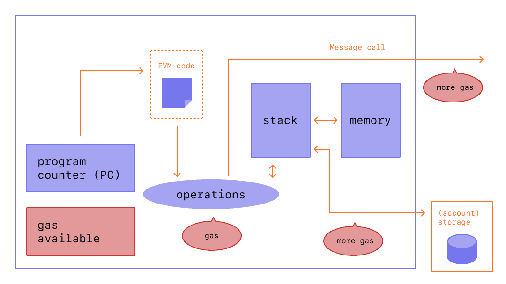
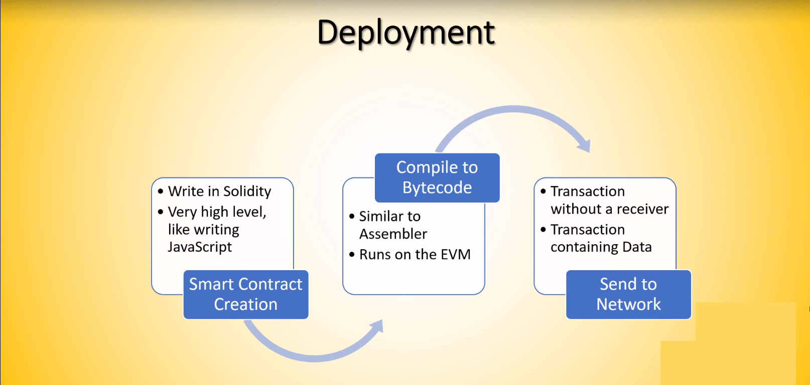

# SEMANA 4 - transaction, gas, WEB3.js, decimal

# 1) Sobre etherum

### **Rede Ethereum**
É uma rede de computadores, chamados nós.
Ethereum é uma rede sem permissão e não hierárquica.
Sao construídos blocos que chegam  a um consenso sobre uma série cada vez maior de BLOCOS, conhecido como blockchain.

### **Bloco** 
Um bloco contém um identificador de cadeia. Deve precedê-lo para que o bloco seja considerado válido.

Quando um nó adiciona um bloco, ele executa as transações nele em sua ordem, alterando os saldos ETH e outros valores de armazenamento das contas Ethereum

### **Estado**
Os saldos e valores, conhecidos coletivamente como THE STATE, são mantidos em uma árvore Merkle no computador do nó, separada do blockchain.

### **Comunicação e propagação de nós**
Cada nó se comunica com um pequeno subconjunto da rede (seus pares).
Quando um nó deseja incluir uma nova transação, ele envia a transação para seus pares, que então a enviam para seus pares e assim por diante.

### **Os mineradores**
são nós que mantêm uma lista de todas essas novas transações e as usam para criar novos blocos, que são enviados para o restante da rede.

### **Validador**
Quando um nó recebe um bloco, ele verifica a validade do bloco e de todas as transações.
Se válido, o nó adiciona o bloco e as transações ao blockchain.
Sendo a rede não hierárquica, ela pode receber blocos concorrentes, que podem formar cadeias concorrentes

### **Consenso**
"A cadeia com mais blocos em um determinado momento é a cadeia canônica".
Isso é chamado de regra LONGEST-CHAIN.
Essa regra chega a um consenso: os mineradores não querem gastar seu trabalho computacional tentando adicionar blocos a uma cadeia que será abandonada pela rede.

### **Proof of Work**
Ethereum atualmente usa Proof of Work como um consenso
Isso permite que os nós da rede Ethereum:
- concordar com o estado das informações registradas no blockchain
- previne alguns ataques econômicos.

### **Proof of Stake**
Este é o novo consenso que será usado pela Ethereum após a fusão.
Os usuários apostam seus ETH para se tornarem VALIDADORES.
Responsabilidades dos validadores:
- pedidos de transações
- criação de novos blocos

### **Transações**
Uma transação é uma instrução assinada criptograficamente de contas.
Uma conta iniciará uma transação para atualizar o estado da rede Ethereum.
Uma transação comum é transferir ETH da conta A para B.

***Ethereum não é uma rede, mas um protocolo que pode ser implementado para criar redes diferentes.***

### **Ether (ETH)**  
Criptomoeda gerada pelo protocolo Ethereum como recompensa aos mineradores em um sistema de prova de trabalho para adicionar blocos ao blockchain.É a única moeda aceita no pagamento das taxas de transação, que também vão para os mineradores.

### **ETH e Ethereum**
A recompensa do bloco, juntamente com as taxas de transação, incentiva os mineradores a manter o blockchain crescendo.
Portanto, a ETH é fundamental para o funcionamento da rede.
Cada conta Ethereum tem um saldo ETH e pode enviar ETH para qualquer outra conta.

### **Contas** 
2 tipos de conta::
- contas de usuário
- contratos
Ambos:
- ter um saldo de ETH
- pode enviar ETH para qualquer acc
- pode chamar uma função pública de um contrato
- pode criar um novo contrato

**Contas de usuário** - o único tipo que pode criar transações. Para que uma transação seja válida, ela deve ser assinada usando a chave privada da conta de envio.O algo usado é ECDSA. Permite derivar o endereço do signatário da assinatura sem a chave privada

**Contas de contratos** - a única conta que tem associado:

- código: conjunto de funções/declarações de variáveis
- armazenamento de contrato: valores das variáveis ​​em um determinado momento

### **Contrato** 

Uma função de contrato pode receber argumentos e pode ter valores de retorno.

Um Contrato pode:
- instruções de fluxo de controle
- incluir instruções para enviar ETH
- realizar operações de E/S
- criar armazenamento temporário
- realizar operações aritméticas/hashing
- chamar suas próprias funções
- chamar as funções públicas dos contratos
- criar novos contratos
- informações de consulta sobre transação/blockchain

### **Endereços**
Os endereços Ethereum são compostos por: "0x" + os 20 bytes mais à direita do hash Keccak-256 da chave pública ECDSA.
Os endereços de contrato estão no mesmo formato, mas são determinados pelo remetente e pela transação de criação.

### **EVM**

É o ambiente de tempo de execução para execução de transações no Ethereum
É uma pilha de registradores de 256 bits, em sandbox dos outros arquivos do nó.
Ele garante que, para um determinado estado e transação pré-transação, cada nó produza o mesmo estado pós-transação.
  

### **Gás**
Gás é uma unidade de conta dentro do EVM usada no cálculo de uma taxa de transação.
É a quantidade de ETH que o remetente de uma transação deve pagar ao minerador que inclui a transação no blockchain.
 

### **Sidechain**
 
É um blockchain independente, projetado para ser compatível com o blockchain Ethereum.Eles podem usar um mecanismo de consenso diferente e têm prós e contras.

## [Como o Ethereum funciona](https://docs.google.com/document/d/1N_5fg51AYgwq2lnXGs33VDWNpfhOZGk37bSsC3Q2674/edit?usp=sharing)
    
## [EVM Illustraded](https://takenobu-hs.github.io/downloads/ethereum_evm_illustrated.pdf) 

# 2) WEB3.js

 
 ### ABI + WEB3.js
 arquivo no formato JSON 
 informaç~oes para interagir com o contrato

 
  ## Deploy de contrato
 

## GAS 
 https://ethereum.org/en/developers/docs/gas/

 ## 3) Como trabalhar com ponto flutuante com solidity

  solididty - tipos ponto flutuante/decimal/float

  
  Ref: 
   [Matemática em Solidity (Parte 1: Números)](https://www.web3dev.com.br/yanluiz/matematica-em-solidity-parte-1-numeros-4jb2)

   [Matemática em Solidity (Parte 2: Overflow)](https://www.web3dev.com.br/yanluiz/matematica-em-solidity-parte-2-overflow-53p6)

   [Matemática em Solidity (Parte 3: Porcentagens e Proporções)](https://www.web3dev.com.br/yanluiz/matematica-em-solidity-parte-3-porcentagens-e-proporcoes-3g83)

   [Matemática em Solidity (Parte 4: Juros Compostos)](https://www.web3dev.com.br/yanluiz/matematica-em-solidity-parte-4-juros-compostos-4b7k)
   
   [Matemática em Solidity (Parte 5: Expoente e Logaritmo)](https://www.web3dev.com.br/yanluiz/matematica-em-solidity-parte-5-expoente-e-logaritmo-25l5)

